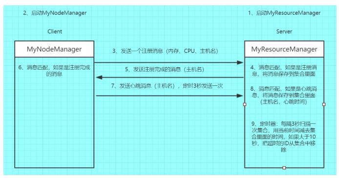

#Scala中的Actor
##1、什么是Actor
一个actor是一个容器，它包含 状态， 行为，信箱，子Actor 和 监管策略，所有这些包含在一个ActorReference（Actor引用）里。一个actor需要与外界隔离才能从actor模型中获益，所以actor是以actor引用的形式展现给外界的。
##2、ActorSystem的层次结构
如果一个Actor中的业务逻辑非常复杂，为了降低代码的复杂度，可以将其拆分成多个子任务（在一个actor的内部可以创建一个或多个actor，actor的创建者也是该actor的监控者） 

一个ActorSystem应该被正确规划，例如哪一个Actor负责监控，监控什么等等：

负责分发的actor管理接受任务的actor
拥有重要数据的actor，找出所有可能丢失数据的子actor，并且处理他们的错误。
##3、ActorPath
ActorPath是通过字符串描述Actor的层级关系，并唯一标识一个Actor的方法。

ActorPath包含协议，位置 和 Actor层级关系
```$xslt
//本地path
"akka://my-sys/user/service-a/worker1"   

//远程path　　akka.tcp://（ActorSystem的名称）@（远程地址的IP）：（远程地址的端口）/user/（Actor的名称）
"akka.tcp://my-sys@host.example.com:5678/user/service-b" 

//akka集群
"cluster://my-cluster/service-c"
```
#4、获取Actor Reference
获取Actor引用的方式有两种：创建 和 查找。 

要创建Actor，可以调用ActorSystem.actorOf(..)，它创建的actor在guardian actor之下，接着可以调用ActorContext的actorOf(…) 在刚才创建的Actor内生成一个actor树。这些方法会返回新创建的actor的引用，每一个actor都可以通过访问ActorContext来获得自己（self），子Actor（children，child）和父actor（parent）。


要查找Actor Reference，可以调用ActorSystem或ActorContext的actorSelection(“path”)，在查找ActorRef时，可以使用相对路径或绝对路径，如果是相对路径，可以用 .. 来表示parent actor。

##actorOf / actorSelection / actorFor的区别
>- actorOf 创建一个新的actor，创建的actor为调用该方法所属的context的直接子actor。
>- actorSelection 查找现有actor，并不会创建新的actor。
>- actorFor 查找现有actor，不创建新的actor，已过时。
#5、Actor和ActorSystem
##Actor：
- 就是用来做消息传递的
- 用来接收和发送消息的，一个actor就相当于是一个老师或者是学生。
- 如果我们想要多个老师，或者学生，就需要创建多个actor实例。
##ActorSystem:
- 用来创建和管理actor，并且还需要监控Actor。ActorSystem是单例的（object）
- 在同一个进程里面，只需要一个ActorSystem就可以了

#6、Actor的示例


